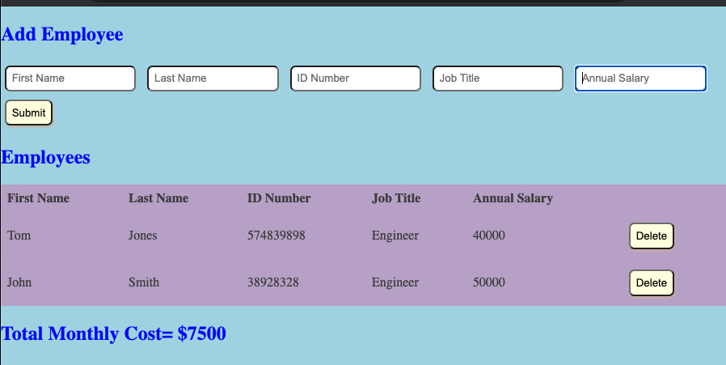

# Employee Salary Calculator

## Description

_Duration: 10 Hours_

This application is designed for an employer to determine their monthly payroll for all of their employees.  The application takes some basic employee inputs, adds them to a table, and calculates the total monthly payroll.  If you want to remove an employee, a delete button allows you to delete said employee from the payroll.

## Screen Shot

## Usage

1. Open the application in a browser.  Have your employee employee information handy.
2. Input employee information: first name, last name, ID, job title, and salary.
3. Press submit after inputting the information to add the employee to the table.
4. In the event you wish to remove an employee from the table, click the delete button.

## Built With

Javascript and jQuery

## Acknowledgement
Thanks to [Prime Digital Academy](www.primeacademy.io) who equipped and helped me to make this application a reality. (Thank you Mary Mosman, Dev Jana, and Paxos Cohort).

## Support
If you have suggestions or issues, please email me at [hoffmann1226@gmail.com]
